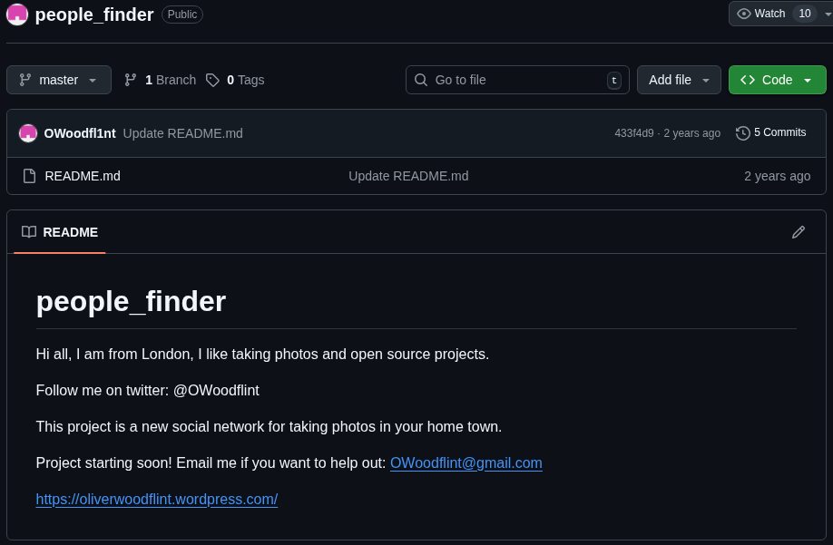

# OHSINT – TryHackMe OSINT Investigation

**A Structured OSINT Walkthrough Demonstrating Practical Reconnaissance Skills**

This repository documents my investigation process for the **OhSINT challenge** from TryHackMe. The objective of this lab was to gather intelligence using only publicly available sources — applying structured OSINT methodology without direct interaction or exploitation.

---

## Executive Summary

The OhSINT challenge simulates a real-world passive reconnaissance scenario. Starting with a single image file, I leveraged metadata analysis, social media correlation, public repository inspection, Wi-Fi intelligence databases, and web source code review to uncover multiple pieces of sensitive information about a target.

This project highlights:

* Structured investigative methodology
* Practical OSINT tool usage
* Cross-platform intelligence correlation
* Identification of exposed sensitive information
* Clear documentation of findings

---

## Core Skills Demonstrated

* Open-Source Intelligence (OSINT)
* Metadata Analysis
* Social Media Profiling
* GitHub Reconnaissance
* Wi-Fi Infrastructure Enumeration
* Source Code Inspection
* Digital Footprint Mapping
* Analytical Thinking & Correlation

---

# Investigation Methodology

## 1️⃣ Initial Artifact Analysis

The challenge provided a single image file.

First step: Extract metadata.

### Tool Used

**ExifTool**

```bash
exiftool image.jpg
```

### Key Findings

* GPS Coordinates embedded
* Copyright tag: **OWoodflint**


This immediately provided both a potential identity and geolocation lead.

---

## 2️⃣ Identity Correlation

A search for the discovered username revealed accounts on:

* GitHub
* X
* WordPress


This enabled cross-platform digital footprint analysis.

---

## 3️⃣ Social Media Analysis

On the subject’s X profile:

* Avatar identified → **Cat**
  
  

* A publicly posted BSSID was discovered:

```
B4:5D:50:AA:86:41
```


This introduced network-level reconnaissance into the investigation.

---

## 4️⃣ Wi-Fi Intelligence Enumeration

Using WiGLE, I queried the BSSID.

### Process:

1. Logged into WiGLE
2. Entered the BSSID
3. Zoomed into London (based on GitHub profile clue)
4. Narrowed the map to street-level

### Result:

**SSID: UnileverWiFi**


---

## 5️⃣ Repository Investigation

While reviewing public repositories on GitHub:

* A personal email address was located within a README file
* Location listed: **London**




This reinforces how public code repositories can unintentionally expose personally identifiable information (PII).

---

## 6️⃣ Blog Intelligence Gathering

The subject’s WordPress blog revealed:

* Holiday location → **New York**


Personal blogging platforms often provide contextual behavioral intelligence.

---

## 7️⃣ Source Code Inspection

Final stage: Review of the blog’s page source.

Within the HTML ...................source, a plaintext string was discovered:

```text
pennYDr0pper.!
```


This highlights the importance of secure development practices and proper credential management.

---

# Key Findings Overview

| Intelligence Type | Discovery                                           |
| ----------------- | --------------------------------------------------- |
| Avatar            | Cat                                                 |
| Location          | London                                              |
| Email             | [OWoodflint@gmail.com](mailto:OWoodflint@gmail.com) |
| Email Source      | GitHub                                              |
| SSID              | UnileverWiFi                                        |
| Holiday Location  | New York                                            |
| Password          | pennYDr0pper.!                                      |

---

# Security Lessons Identified

This lab reinforces several real-world cybersecurity concerns:

* Metadata can unintentionally expose identity and location
* Public repositories may leak sensitive data
* Social media posts can expose infrastructure details
* Blog source code may contain hidden credentials
* Poor operational security (OPSEC) creates aggregation risk

Even when individual data points seem harmless, correlation can reveal significant exposure.

---

# Why This Project Matters

For recruiters and hiring managers, this repository demonstrates:

* Structured problem-solving approach
* Clear investigative documentation
* Technical familiarity with OSINT tools
* Ability to connect multi-source intelligence
* Strong analytical reasoning
* Security awareness mindset

The project reflects practical application of reconnaissance techniques relevant to:

* Cyber Threat Intelligence
* Penetration Testing (Recon Phase)
* Red Teaming
* Security Analysis
* SOC Operations

---

# Tools Utilized

* ExifTool
* Google Search Operators
* GitHub repository inspection
* WiGLE network database
* Browser Developer Tools (Source Code Review)

---

# Conclusion

The OhSINT challenge provided a practical demonstration of how publicly accessible information can be aggregated to build a detailed intelligence profile.

> Effective cybersecurity begins with understanding what is already exposed.

By applying structured OSINT methodology, I successfully mapped the target’s digital footprint using only passive techniques.

---


Do you want me to do that?
